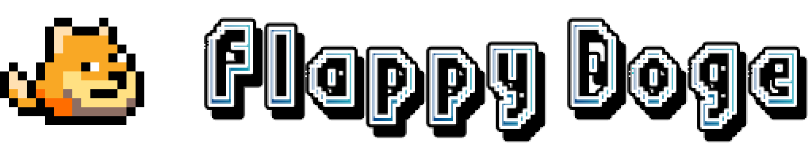
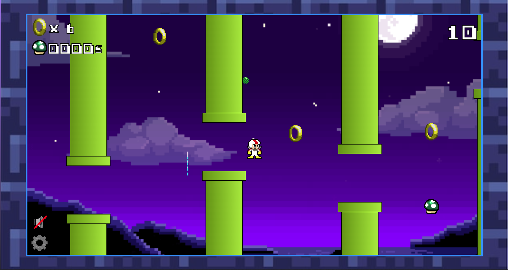

# TRABALHO 02 - TECNOLOGIAS WEB

> 📽️ [Vídeo de apresentação](https://youtu.be/2959oA8AMzs)

-----

  

## FLAPPY DOGE

<h4 align="center">
  Flappy doge é uma imitação do jogo Flappy bird utilizando pixelart e elementos de outros jogos/desenhos como mario, sonic e ben 10. 🕹️
</h4>

  

## 🧪 Tecnologias

   
  

Este projeto foi desenvolvido usando as seguintes tecnologias:

- [HTML5](https://developer.mozilla.org/en-US/docs/Web/HTML)
- [CSS3](https://developer.mozilla.org/en-US/docs/Web/CSS)
- [JavaScript](https://developer.mozilla.org/en-US/docs/Web/JavaScript)
